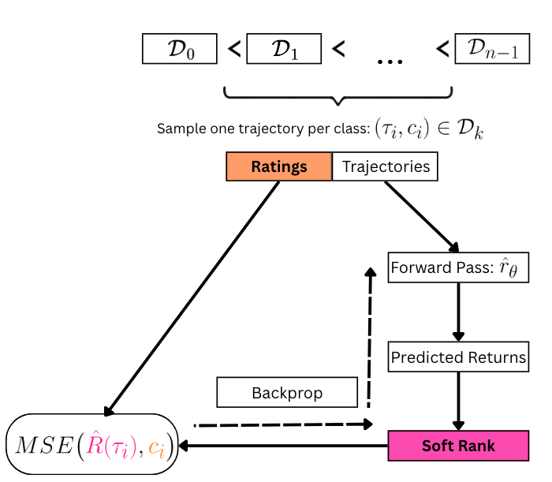
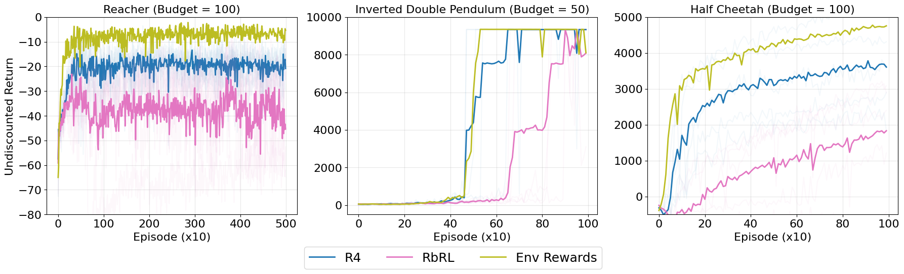
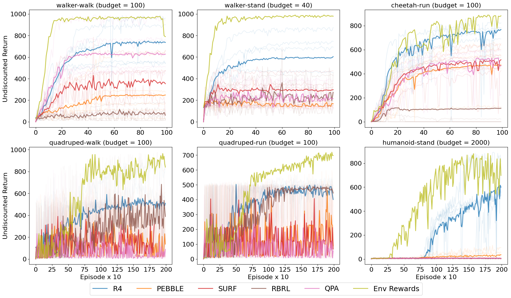
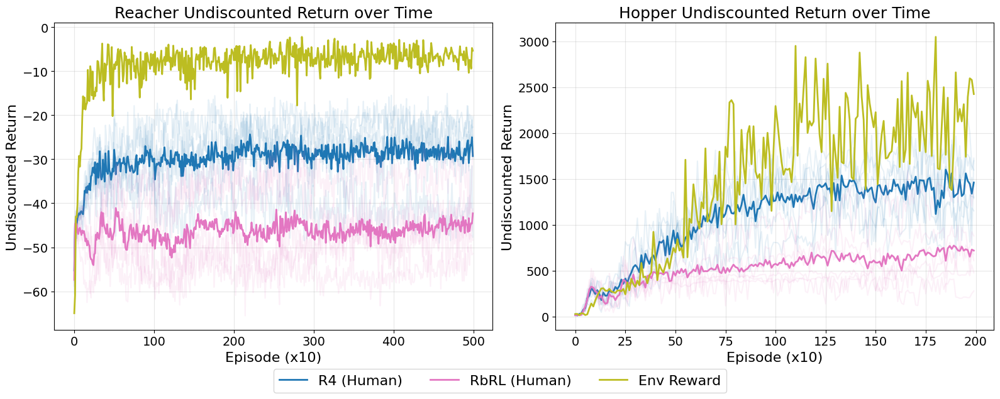

## Abstract

Reward design remains a significant bottleneck in applying reinforcement learning (RL) to real-world problems. 
A popular alternative is reward learning, where reward functions are inferred from human feedback rather than manually specified.
Recent work has proposed learning reward functions from human ratings rather than traditional binary preferences, enabling richer and potentially less cognitively demanding supervision. 
Building on this paradigm, we introduce a new rating-based RL method,  Ranked Return Regression for RL (R4).
At its core, R4 uses a novel ranking mean squared error loss that learns from a dataset of trajectory-rating pairs, treating the human-provided discrete ratings (e.g., "bad," "neutral," "good") as ordinal targets.
Unlike prior rating-based approaches, R4 offers formal guarantees: its solution set is provably minimal and complete under mild assumptions. Empirically, using both human-provided and simulated ratings, we demonstrate that R4 consistently matches or outperforms existing rating and preference-based RL methods on robotic benchmarks from OpenAI Gym and the DeepMind Control Suite.

## Method

We propose **Ranked Return Regression for RL (R4)**, a rating-based RL
algorithm that learns a reward function from trajectories labeled with
ordinal ratings via a novel ranking mean squared error (rMSE) loss.

### Problem Setting

We work with an MDP without rewards (MDP\\R), augmented with human-provided
ratings. A human observes trajectory $\tau$ and and assigns it a rating \\(c(\tau) \in \\{ 0, 1, \cdots, n-1 \\}\\), where $$0$$ indicates lowest quality and $n-1$ indicates highest quality.

### Key Insight
Given a dataset of rated trajectories where lower trajectory rating implies lower quality, the following implication should hold:

\\[
 c(\tau_i) < c(\tau_j) \implies G_{r^\*}(\tau_i) < G_{r^\*}(\tau_j)
\\]

where \\(G_{r^\*}(\tau)\\) is the estimated return of trajectory $\tau$ under the unknown (implicit to human) reward function \\(r^\*\\). Therefore, by sampling one trajectory from each class, we obtain a perfectly ordered ranking over n trajectories, which we exploit to define the rMSE objective.

### Ranking Mean Squared Error Objective

At each training step, we sample one trajectory $\tau_i$ for each rating class and estimate its discounted return under the current reward model $\hat{r}_\theta$. We then rank the predicted returns using a [differentiable sorting
operator](https://arxiv.org/abs/2002.08871), producing soft ranks $\hat{R}$, with $\hat{R}(\tau_i)$ denoting the soft rank of trajectory $\tau_i$. The rMSE loss is:

$$
\begin{equation}
  \mathcal{L}_{\text{rMSE}} = \frac{1}{n} \sum_{i=0}^{n-1} \left( \hat{R}(\tau_i) - c(\tau_i) \right)^2
\end{equation}
$$

Since soft ranks are differentiable with respect to the reward parameters,
minimising this loss adjusts $\hat{r}_\theta$ to align predicted return orderings with
human ratings.

<figure style="width: 50%; margin: 0 auto;">
  
  <figcaption>
    <strong>Overview of RMSE reward learning.</strong>
    Given a ratings dataset, we sample one trajectory from each rating class and estimate the returns using estimated reward model. These estimated returns are then ranked and rMSE is calculated. The loss is then backpropagated to update the estimated reward model.
  </figcaption>
</figure>

### Theoretical Results

Our theory results establish that under mild assumptions, the solution set of rMSE objective is exactly the set of reward functions consistent with the dataset. This means that no loss function can further reduce the solution set of the rMSE without missing out on some possible data-generating reward functions.

### Empirical Results

We test R4 against the baselines under simulated offline, online and real user offline settings. Across these settings, R4 outperforms the relevant baselines.

<figure>
  
  <figcaption>
    <strong>Performance of a SAC agent trained with (1) R4, (2) RbRL, and (3) the environment reward in an offline setting.</strong>
  </figcaption>
</figure>

  

<figure>
  
  <figcaption>
    <strong>Online SAC training using the environment reward or rewards learned from different rating (RbRL)- and preference-based (PEBBLE, SURF, QPA) algorithms.</strong>
  </figcaption>
</figure>

  

<figure>
  
  <figcaption>
    <strong>SAC performance with R4 and RbRL reward functions learned from trajectory ratings collected in the user study.</strong>
  </figcaption>
</figure>

## Conclusion

Reward design remains a fundamental challenge in RL. We propose R4, a
theoretically grounded algorithm for learning reward functions from
multi-class human ratings. Unlike prior work, R4 treats ratings as ordinal
feedback and optimises a rank-based mean squared error loss, allowing the
reward model to better exploit the rating structure in labeled trajectories.
Theoretically, R4 yields minimal and complete solutions under mild
assumptions. Empirically, it outperforms existing rating- and
preference-based baselines in both offline and online settings. A human-user
study confirms that R4 is robust to real human variability and that providing
ratings imposes low cognitive workload on participants.